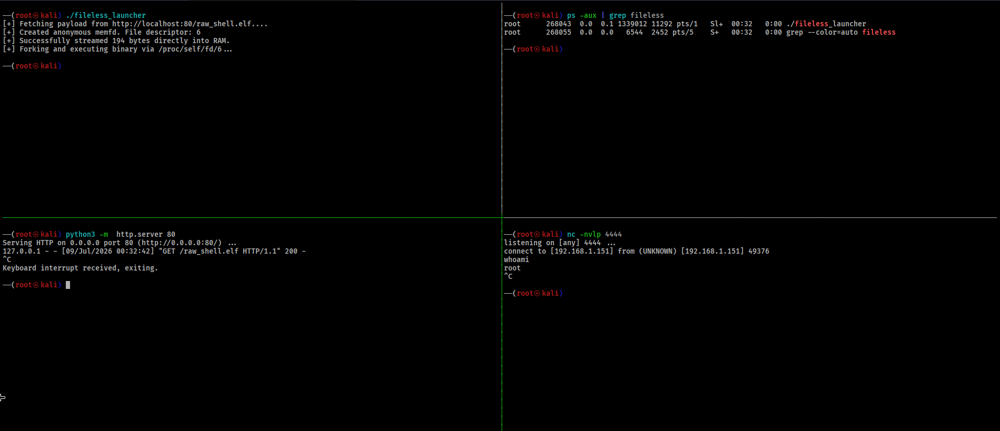
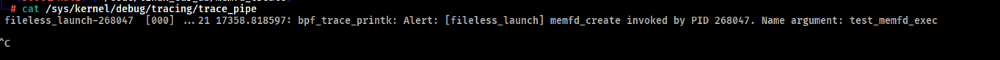

```bash
clang -O2 -target bpf -g -c monitor.bpf.c -o monitor.bpf.o
bpftool prog load monitor.bpf.o /sys/fs/monitor_prog autoattach
cat /sys/kernel/debug/tracing/trace_pipe
```

Testing Commands 
```bash
cd test
python3 -m http.server 80
nc -nvlp 4444
./fileless_launcher
```
